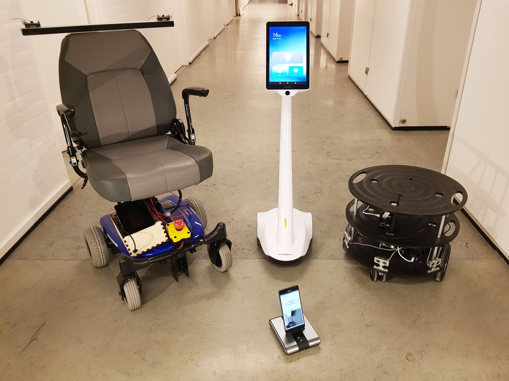
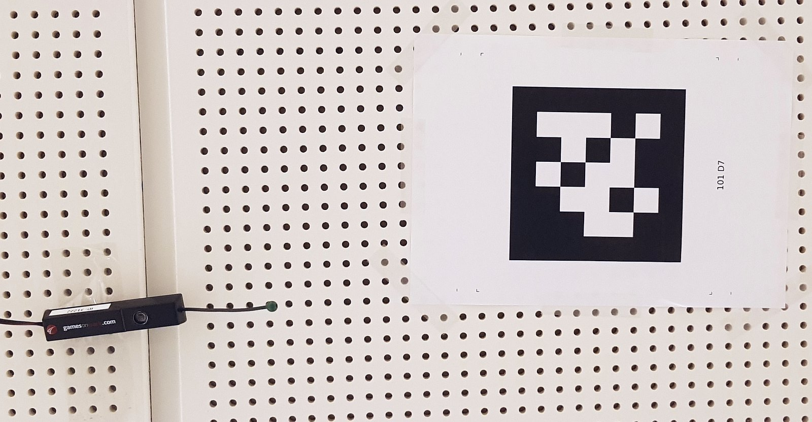
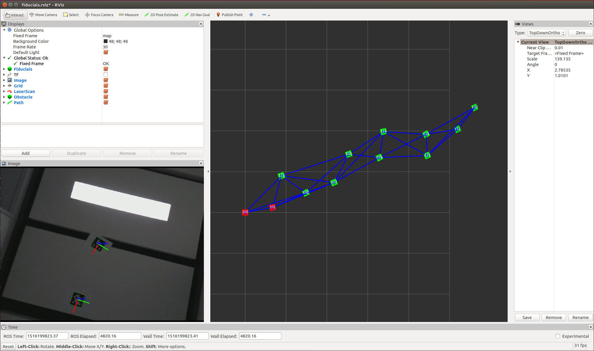
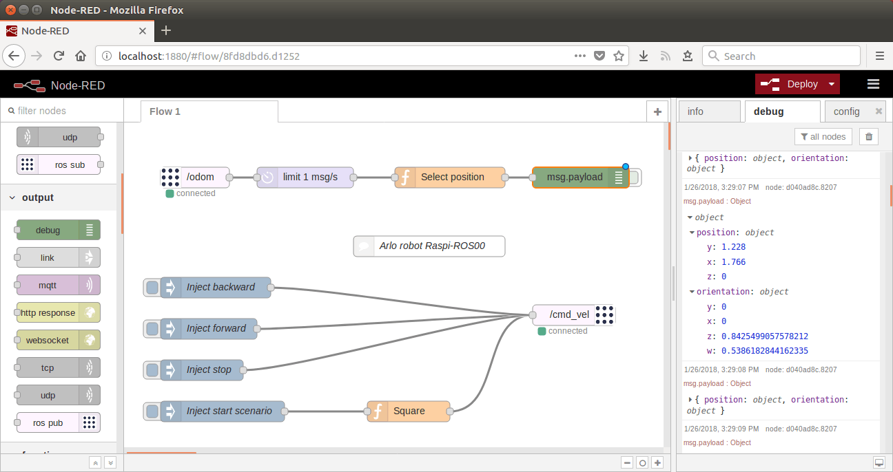
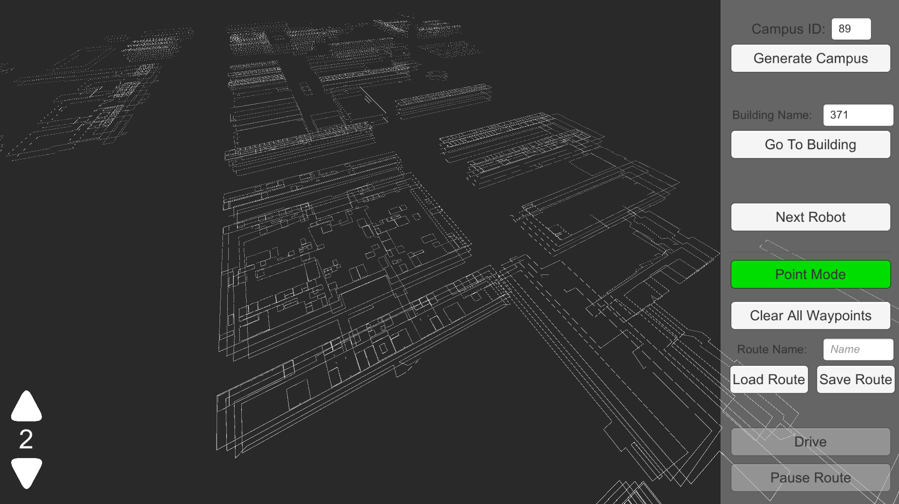
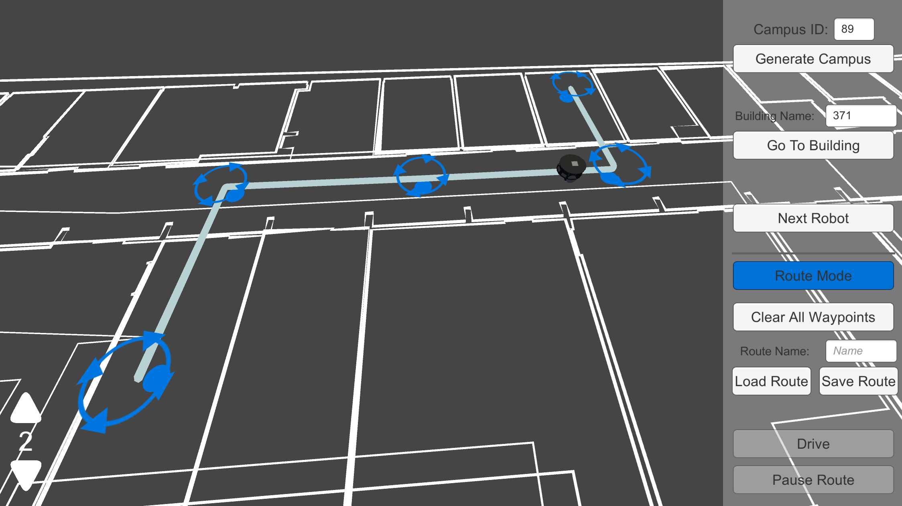
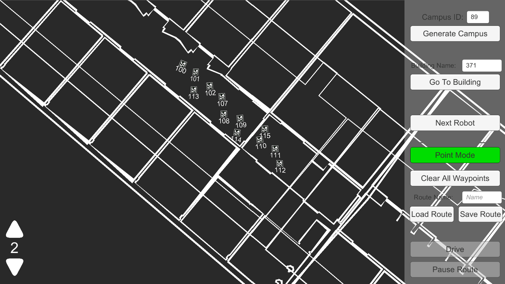
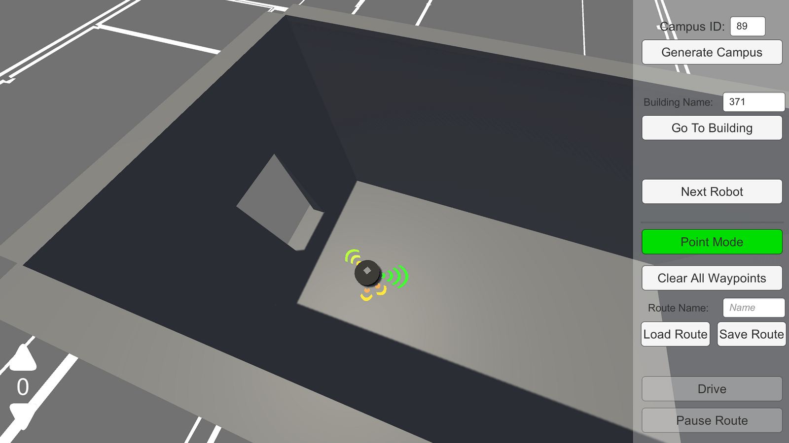

# [DTU-R3: Remote Reality Robot](https://dtu-r3.github.io/)

## Introduction
We focus on affordable mobile robots that can navigate semi-autonomously indoors, sometimes outdoors,
and that are able to carry at least a webcam or a 360° camera, among other sensors.

A significant part is the simulation of those robots as well as interactions in 3D.

To ensure reproducibility and to widen the possible use-cases, we implement the same approaches on several robots,
ranging from some off-the-shelf toys to developer-oriented robotic platforms, and to retrofitted wheel-chairs.

## Vision
Faciliate multi-disciplinary research & development around mobile robots,
and provide a shared platform for people not necessarility skilled in robotics
to experiment with innovative concepts in the direction of “robots as a service”.

## Intention
The project originate from the [DTU “Technical University of Denmark”](http://www.dtu.dk/english/),
[Department of Management Engineering](http://www.man.dtu.dk/english),
and its purpose is to promote collaboration between the different groups interested in
the various facets of working with such mobile robots, also from other institutes, universities, and countries.

Indeed, when starting this initiative in September 2017, we saw that there was room for improvement to better work together,
build upon each-other achievements, and thus pushing forward the quality of student and research projects,
instead of too often restarting from scratch.

This is done by lowering the bar to get started with mobile robots,
and providing more features out-of-the-box,
for student project, research projects, or even prototypes towards products.
We are also very much price-concious, as this is a key to adoption.

Thanks to a lot of existing, open-source work out there, we mainly pick, test, adapt, and document available components.
In particular, we build upon [ROS “Robot Operating System”](http://www.ros.org/), and its large ecosystem.
Please see the credits in the various components that we are reusing.

For similar reasons, we have picked the [Unity 3D engine](https://unity3d.com/) for our simulations and interactions needs,
since it is the most widely used 3D engine worldwide, and is therefore well-known by most people working with 3D,
including students not familiar with robotics.

Finally, since robotic projects are complex, a focus is set on standardisation, modularisation, documentation,
and other good practices.

## Software architecture

We package the different software components as [Docker containers](https://www.docker.com/what-docker) to make then easy and robust to deploy, test, and interoperate. This ensures in particular a good reproducibility and separation of concerns, which is especially good for projects that do not have an active core team to maintain everything all the time.
This is for instance the case for series of student projects.
It is also useful for running the same software packages during simulation than the ones running on the robots.

* Read more about that in our [Docker-ROS documentation](https://github.com/DTU-R3/Docker-ROS).

## Robot sofware components

### Robot models

* [Parallax Arlo robot](https://github.com/DTU-R3/Docker-ROS/tree/master/r3-arlobot)
* [Padbot](https://github.com/DTU-R3/android_core/tree/dtu-r3/padbot)
* [Wheelchair](https://github.com/DTU-R3/Wheelchairduino-ROS)

### Positioning

Positioning is an essential part of robot scenarios.
We work with a few different technologies for robot positioning,
such as wheel encoders, Fiducials 2D markers, ultrasound with [Games on Track](http://www.gamesontrack.com/), and based on stereoscopic vision.

* Read more about than in our:
	* [Fiducials documentation](https://github.com/DTU-R3/Docker-ROS/tree/master/r3-fiducials).
		* Using a [Raspberry Pi Camera Module](https://github.com/DTU-R3/Docker-ROS/tree/master/r3-raspicam).
	* [Games on Track documentation](https://github.com/DTU-R3/GamesOnTrack-ROS)

### Navigation

Navigation requires a positioning technology and is then able to make the robot move to other coordinates or points of interest.
We mainly use GPS coordinates to define the way-points to navigate to.

* Read more about than in our [navigation documentation](https://github.com/DTU-R3/Docker-ROS/tree/master/r3-navigation).

### Interaction

Our robots also have a possibility to be manually controlled, e.g. via joystick or keyboard,
and either attached to the robot, or from a remote computer.

* Read more about than in our [teleoperation documentation](https://github.com/DTU-R3/Docker-ROS/tree/master/r3-teleop).

### Scenarios

For simple programming of robot scenarios as well as interaction with other IoT systems,
we for instance have a compatibility with the visual programming tool [Node-RED](https://nodered.org/).

* Read more about than in our [Node-RED documentation](https://github.com/DTU-R3/Docker-ROS/tree/master/r3-node-red).
	* Using a [ROS-to-WebSocket bridge](https://github.com/DTU-R3/Docker-ROS/tree/master/r3-ws-bridge).

## 3D features

Our 3D interfaces and simulations made in Unity are meant to run on a (desktop) computer, not on the robots,
but they are able to receive information and control our physical as well as virtual (simulated) robots.

* See the [Unity code](https://github.com/DTU-R3/VRClient/tree/develop)

### 3D campus

Our Unity software is able to import building data from [MazeMap](https://www.mazemap.com/),
as well as way-point routes for way-finding (e.g. move from one office to another).

* See for instance the [DTU Lyngby campus in MazeMap](https://use.mazemap.com/#campusid=89)

### Way-point navigation

The Unity interface can be used to visually build some way-point routes.

Unity also keeps and share with the robots the position of the Fiducials:

### Simulated sensors

Our Unity software can also be used for virtual (simulated) robots,
in particular with a simulation of the sensors (such as the proximity sensors).

When running simulations, Unity only implements the physical layer of the robots,
while most of the higher level logic is done by running the same (ROS) software packages
than on the physical robots.

## Use-cases

* Telepresence: such as an assistive technology for people with handicaps, or for remote inspection of a building
* Airports: such as for helping people moving to the gate, or as a security watch
* 360° documentation: such as for documenting the progress of a building being constructed
* Etc.

## Team

* [John Paulin Hansen](http://orbit.dtu.dk/en/persons/john-paulin-hansen(119e0e25-cbb9-478c-bee2-db6d2d9c4b90).html): Professor, project leader
* [Alexandre Alapetite](http://orbit.dtu.dk/en/persons/alexandre-alapetite(0ed01dd3-bd70-4977-b74d-98ebc70b6674).html): Technical lead, in collaboration with [Alexandra Institute](https://alexandra.dk/alexandre.alapetite)
* [Martin Thomsen](http://orbit.dtu.dk/en/persons/martin-thomsen(73982a22-25b9-42ae-9da6-9e7c3f981d97).html): Unity developer
* [Zhongyu Wang](http://orbit.dtu.dk/en/persons/zhongyu-wang(845b4243-b957-4817-b320-e1f22f04a8b2).html): Robotics
